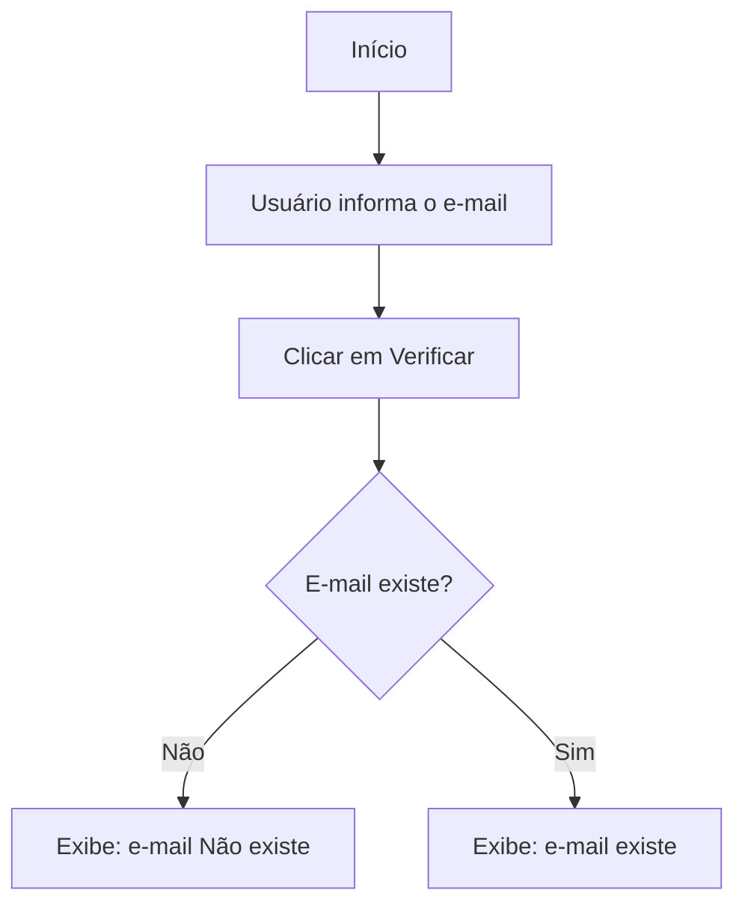

# Verificador de E-mail

## 📌 Visão Geral

Este projeto é uma aplicação **desktop em Python** com interface gráfica (Tkinter) que permite ao usuário **verificar se um endereço de e-mail é válido** utilizando uma abordagem em múltiplas etapas:

* Validação de formato do e-mail
* Verificação de domínio (MX Records)
* Verificação SMTP (best effort)

O sistema retorna um **feedback visual imediato**:

* ✅ **OK ✔ Email existe** (texto verde)
* ❌ **Email inválido / Email não existe / Domínio não recebe e-mails** (texto vermelho)

> ⚠️ **Aviso**: Nenhum sistema consegue garantir 100% se um e-mail realmente existe. Muitos servidores SMTP bloqueiam esse tipo de verificação por políticas de segurança e antispam. Este projeto utiliza a melhor abordagem técnica possível (*best effort*).

---

## 🧰 Tecnologias e Bibliotecas

* **Python 3.9+**
* **Tkinter** — Interface gráfica
* **email-validator** — Validação de formato do e-mail
* **dnspython** — Consulta DNS (MX Records)
* **smtplib** — Comunicação SMTP

---

## 📂 Estrutura do Projeto

```text
verificador-email/
│
├── verificaEmail.py   # Código-fonte principal
└── README.md          # Documentação do projeto
```

---

## ▶️ Como Executar

### 1. Instalar dependências

```bash
pip install email-validator dnspython
```

### 2. Executar a aplicação

```bash
python verificaEmail.py
```

A interface gráfica será exibida permitindo a digitação do e-mail e a verificação.

---

## 🔍 Funcionamento do Sistema

A verificação do e-mail ocorre em **três etapas sequenciais**:

### 1️⃣ Validação de Formato

* Verifica se o e-mail segue o padrão correto (ex: `usuario@dominio.com`)
* Utiliza a biblioteca `email_validator`
* Caso inválido, o processo é encerrado

### 2️⃣ Verificação de Domínio (MX Records)

* Consulta os registros DNS do domínio
* Verifica a existência de registros **MX**
* Caso não existam, o domínio é considerado incapaz de receber e-mails

### 3️⃣ Verificação SMTP (*Best Effort*)

* Conecta ao servidor de e-mail (MX)
* Executa o comando `RCPT TO` para o endereço informado
* Avalia o código de resposta retornado pelo servidor

Códigos SMTP aceitos como válidos:

* `250`
* `251`

---

## 🔄 Fluxo de Execução



---

## 🎯 Boas Práticas Utilizadas

* Programação orientada a objetos
* Separação clara de responsabilidades
* Tratamento de exceções
* Interface simples e intuitiva
* Timeout configurado para conexões SMTP

---

## 🚀 Melhorias Futuras

* Execução assíncrona (threads ou asyncio)
* Barra de progresso durante a verificação
* Registro de logs
* Verificação em lote de e-mails
* Tema escuro (Dark Mode)

---

#Comando Gerar Executável
#pyinstaller --onefile --windowed --icon=email.ico --name="VerificaEmail" VerificaEmail.py
pyinstaller --onefile --windowed --name="VerificaEmail" VerificaEmail.py


## 👨‍💻 Autor

Fábio Calso de Mattos.
